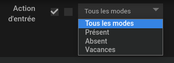

# Mode Plugin

Das Plugin **Mode** ermöglicht es Ihnen, Modi zu erstellen, um verschiedene Funktionen einfach zu verwalten *(Gehäuse, Alarm, Anwesenheit usw...)* und Aktionen automatisch ausführen, wenn Sie zwischen den Modi wechseln.

# Configuration

Dieses Plugin erfordert keine spezielle Konfiguration und muss nach der Installation einfach aktiviert werden.

## Gerätekonfiguration

Um auf die verschiedenen Geräte zuzugreifen **Mode**, du musst ins menü gehen **Plugins → Organisation → Mode**.

>**INFORMATION**
>
>Mit der Schaltfläche + Hinzufügen können Sie ein neues Gerät hinzufügen **Mode**.

Klicken Sie auf ein Gerät **Mode** um auf seine Verwaltungsseite zuzugreifen. Die erste Registerkarte bietet Zugriff auf die Gerätekonfigurationsoptionen :

- **Ausrüstungsname** : Gerätename Modus.
- **Übergeordnetes Objekt** : Gibt das übergeordnete Objekt an, zu dem das Gerät gehört.
- **Kategorie** : Ermöglicht die Auswahl der Gerätekategorie.
- **Optionen** :
    - **Aktivieren** : Ermöglicht es Ihnen, das Gerät zu aktivieren.
    - **Sichtbar** : Macht Ausrüstung sichtbar.

- **Sperrbefehl** : Kontrollkästchen zum Anzeigen des Sperrbefehls im Widget.

Auf der zweiten Registerkarte können wir die verschiedenen Modi des Geräts sowie bei Bedarf die damit verbundenen Aktionen definieren :

- **Modus hinzufügen** : Klicken Sie auf die Schaltfläche, um einen neuen Modus im Gerät zu erstellen.

Nachfolgend finden Sie die Liste der vorhandenen Modi :

Klicken Sie auf die Zeile eines Modus, um seine Konfiguration bereitzustellen und auf die Verwaltung von Ein-/Austrittsaktionen zuzugreifen. Die Ausführung dieser Aktionen kann durch den Modus bedingt sein, aus dem man kommt *(vorheriger Modus)* für Eingabeaktionen oder durch den Modus, in den Sie gehen *(nächster Modus)* für Exit-Aktionen (vgl [die Beispiele](#Exemples)).

>**INFORMATION**
>
>Klicken Sie auf den Namen des Modus, um ihn zu ändern. Achtung, im Falle einer Änderung des Namens eines Modus müssen alle Szenarien/Geräte überprüft werden, die unter seinem alten Namen darauf verwiesen haben.

# Commandes

Die Liste der Bestellungen kann durch Klicken auf die Schaltfläche eingesehen werden **Erweiterte Einrichtung** eines Gerätes **Mode**. Jeder in einem Gerät erstellte Modus generiert zusätzlich zu den vorhandenen Befehlen den entsprechenden Aktionsbefehl :

- **Verriegelung** :
    - **Verriegeln Entriegeln** : Ermöglicht Ihnen, den Thermostat zu sperren, um eine Modusänderung zu verhindern.
    - **Freischalten** : Entriegelt den Thermostat.
>Die Kiste **Sperrbefehl** muss aktiviert sein, damit dieser Befehl im Widget angezeigt wird.

- **Mode** : Momentaner Zustand.
- **Vorheriger Modus** : Vorheriger Modus *(Befehl standardmäßig nicht sichtbar)*.
- **Zurück zum vorherigen Modus** : Ermöglicht die Rückkehr zum zuvor aktiven Modus.
- **Gehen Sie zum nächsten Modus** : Ermöglicht Ihnen, zum nächsten Modus in der Liste zu wechseln.

# Exemples

## Bereichsmodi

Beispiel für Ausrüstung ohne Ein- oder Ausstiegsaktionen in den Modi. Geräte dieses Typs können als Auslöser für ein Szenario oder zur Konditionierung von Aktionen in einem Szenario nützlich sein :

## Anwesenheitsmodi

Beispiel für Geräte mit definierten Aktionen beim Wechseln des Modus. In diesem Gerät erstellen wir 3 Modi auf der Registerkarte **Modi** Ausrüstung :

- **Vorhanden**
- **Abwesend**
- **Ferien**

Beim Umschalten in den Modus **Vorhanden**, Wir möchten, dass der Alarm deaktiviert und die Heizung eingeschaltet wird *Komfort (2 Eingangsaktionen)* :

Beim Verlassen des Modus **Vorhanden** in den Modus wechseln **Abwesend** oder **Ferien**, Wir möchten, dass der Alarm aktiviert wird *(1 Exit-Aktion)* :

Über die Modi **Abwesend** und **Ferien**, Wir werden nur auf jeder 1-Eingabe-Aktion erstellen, um die Heizung zu verwalten, *Umweltfreundlich* für Mode **Abwesend** und *Frostschutz* für Mode **Ferien** :

### Betriebspräsenz

- Wenn wir den Modus verlassen **Vorhanden** in Mode **Abwesend**, Der Alarm wird aktiviert (Aktion zum Beenden **Vorhanden**) und die Heizung schaltet auf *Umweltfreundlich* (Moduseintrittsaktion **Abwesend**).  
- Wenn wir den Modus verlassen **Vorhanden** in Mode **Ferien**, Der Alarm wird aktiviert (Aktion zum Beenden **Vorhanden**) und die Heizung schaltet auf *Frostschutz* (Moduseintrittsaktion **Ferien**).
- Wenn wir den Modus verlassen **Abwesend** in Mode **Vorhanden**, Der Alarm ist deaktiviert (Eingabeaktion des **Vorhanden**) und die Heizung schaltet auf *Kompfort* (Moduseintrittsaktion **Vorhanden**).
- Wenn wir den Modus verlassen **Abwesend** in Mode **Ferien**, Heizung schaltet um *Frostschutz* (Moduseintrittsaktion **Ferien**).
- Wenn wir den Modus verlassen **Ferien** in Mode **Vorhanden**, Der Alarm ist deaktiviert (Eingabeaktion des **Vorhanden**) und die Heizung schaltet auf *Kompfort* (Moduseintrittsaktion **Vorhanden**).
- Wenn wir den Modus verlassen **Ferien** in Mode **Abwesend**, Heizung schaltet um *Umweltfreundlich* (Moduseintrittsaktion **Abwesend**).

## Modi Anwesenheit bis

Wir haben das vorherige Beispiel geringfügig geändert, um die Filterung nach Aktionen zu veranschaulichen :

Dazu wird der Alarm beim Verlassen des Modus nicht mehr aktiviert **Vorhanden** aber bei der Eingabe von Modi **Abwesend** und **Ferien**. Nach der Modifikation erhalten wir folgendes Ergebnis :

>**INFORMATION**
>
>auf die Modi **Abwesend** und **Ferien**, Der Alarm wird nur aktiviert, wenn Sie aus dem Modus kommen **Vorhanden**. Wenn wir gehen von **Abwesend** beim **Ferien** *(Oder umgekehrt)*, Der Alarm ist bereits aktiviert, sodass die Aktion nicht wiederholt werden muss.

### Betrieb Anwesenheit bis

- Wenn wir den Modus verlassen **Vorhanden** in Mode **Abwesend**, Der Alarm ist aktiviert (Moduseintragsaktion **Abwesend**) und die Heizung schaltet auf *Umweltfreundlich* (Moduseintrittsaktion **Abwesend**).  
- Wenn wir den Modus verlassen **Vorhanden** in Mode **Ferien**, Der Alarm ist aktiviert (Moduseintragsaktion **Ferien**) und die Heizung schaltet auf *Frostschutz* (Moduseintrittsaktion **Ferien**).
- Wenn wir den Modus verlassen **Abwesend** in Mode **Vorhanden**, Der Alarm ist deaktiviert (Eingabeaktion des **Vorhanden**) und die Heizung schaltet auf *Kompfort* (Moduseintrittsaktion **Vorhanden**).
- Wenn wir den Modus verlassen **Abwesend** in Mode **Ferien**, Heizung schaltet um *Frostschutz* (Moduseintrittsaktion **Ferien**). Der Alarm ist nicht aktiviert.
- Wenn wir den Modus verlassen **Ferien** in Mode **Vorhanden**, Der Alarm ist deaktiviert (Eingabeaktion des **Vorhanden**) und die Heizung schaltet auf *Kompfort* (Moduseintrittsaktion **Vorhanden**).
- Wenn wir den Modus verlassen **Ferien** in Mode **Abwesend**, Heizung schaltet um *Umweltfreundlich* (Moduseintrittsaktion **Abwesend**). Der Alarm ist nicht aktiviert.
